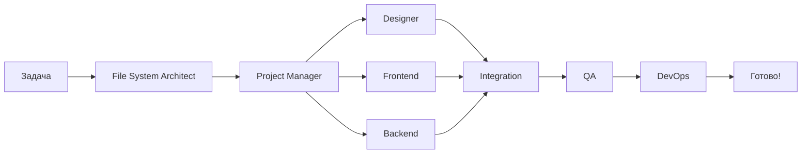

# 📚 Документация проекта

## Обзор команды

Добро пожаловать в базу знаний по созданию сайтов! Здесь собрана вся информация о нашей профессиональной команде из **9 специалистов** с полной автоматизацией и оркестрацией.

## 👥 Команда (9 специалистов)

| № | Специалист | Роль | Приоритет |
|---|------------|------|-----------|
| 0️⃣ | **File System Architect** | Структура и организация | 🔴 Критичный |
| 1️⃣ | **Project Manager** | Оркестратор команды | 🔴 Критичный |
| 2️⃣ | **UI/UX Designer** | Дизайн и UX | 🟠 Высокий |
| 3️⃣ | **Frontend Developer** | Клиентская разработка | 🟠 Высокий |
| 4️⃣ | **Backend Developer** | Серверная разработка | 🟠 Высокий |
| 5️⃣ | **Full-Stack Developer** | Архитектура | 🟡 Средний |
| 6️⃣ | **DevOps Engineer** | Инфраструктура | 🟡 Средний |
| 7️⃣ | **QA Engineer** | Тестирование | 🟢 Обычный |
| 8️⃣ | **SEO Specialist** | Оптимизация | 🟢 Обычный |

## 📖 Документация

### Для быстрого старта:
- **[🚀 Quick Start](./quick-start.md)** - Начните здесь!
- **[👥 Структура команды](./team-structure.md)** - Кто есть кто
- **[🗂️ File System Architect](./file-system-architect.md)** - Организация проекта

### Для разработчиков:
- **[🔄 Workflow Guide](./workflow-guide.md)** - Как работать с командой
- **[📋 STRUCTURE.md](../STRUCTURE.md)** - Карта проекта (генерируется автоматически)

### Конфигурация:
- **[⚙️ Orchestrator Config](../config/orchestrator.json)** - Настройки оркестратора

## 🎯 Что умеет команда

### 🌐 Типы проектов

| Проект | Сложность | Команда | Срок |
|--------|-----------|---------|------|
| Landing Page | 🟢 Простой | 4-5 агентов | 1-2 недели |
| Корпоративный сайт | 🟡 Средний | 6-7 агентов | 3-4 недели |
| E-commerce | 🟠 Сложный | Вся команда | 6-8 недель |
| SaaS Platform | 🔴 Очень сложный | Вся команда | 8-12 недель |

### 💻 Технологии

**Frontend:**
- React 18+ / Next.js 15
- TypeScript
- Tailwind CSS
- Vite / Webpack 5

**Backend:**
- Node.js (Express/Nest.js)
- Python (FastAPI/Django)
- PostgreSQL / MongoDB

**DevOps:**
- Docker & Kubernetes
- GitHub Actions
- AWS / Vercel / Netlify

## 🚀 Быстрые команды

```bash
# Инициализация команды
./scripts/init-team.sh

# Проверка структуры проекта
node scripts/validate-structure.js

# Генерация карты проекта
node scripts/generate-structure-map.js

# Статус команды
npx claude-flow@alpha swarm status

# Метрики производительности
npx claude-flow@alpha agent metrics
```

## 🗂️ File System Architect - НОВИНКА!

**Специальный агент для организации проекта:**

✅ Следит за правильной структурой папок
✅ Обеспечивает логичную организацию
✅ Управляет нумерацией файлов
✅ Валидирует naming conventions
✅ Генерирует карты проекта
✅ Автоматически проверяет качество структуры

### Автоматическая валидация:
- ❌ Нет файлов в корне (кроме конфигов)
- ✅ README в важных папках
- ✅ Правильная нумерация
- ✅ Naming conventions
- ✅ Максимум 5 уровней вложенности
- ✅ Файлы до 500 строк

## 📊 Метрики качества

### Структура проекта:
- 🟢 **Отлично** (90-100%) - Идеальная организация
- 🟡 **Хорошо** (70-89%) - Минорные улучшения
- 🟠 **Средне** (50-69%) - Нужна реорганизация
- 🔴 **Плохо** (0-49%) - Критично переделать

### Команда:
- **Скорость**: 2-4 недели на MVP
- **Качество**: 90%+ test coverage
- **Performance**: 95+ PageSpeed
- **SEO**: Top 10 поисковики
- **Uptime**: 99.9%

## 🎓 Как начать работу

### Шаг 1: Инициализация
```bash
./scripts/init-team.sh
```

### Шаг 2: Опишите проект
Просто скажите что нужно:
```
"Создай landing page для стартапа с hero секцией,
features, pricing и формой обратной связи"
```

### Шаг 3: Команда работает
Claude Code автоматически:
- ✅ Запустит всех агентов параллельно
- ✅ File System Architect создаст структуру
- ✅ Designer создаст дизайн
- ✅ Developers реализуют код
- ✅ QA протестирует
- ✅ DevOps задеплоит

## 🔄 Рабочий процесс



## 💡 Примеры использования

### Landing Page за 5 дней:
```
Task: "Создай landing для AI-стартапа"

Результат:
✅ Дизайн-система в Figma
✅ Next.js + Tailwind site
✅ Email integration
✅ PageSpeed 98/100
✅ Deploy на Vercel
```

### E-commerce за 6 недель:
```
Task: "Интернет-магазин одежды"

Результат:
✅ Современный UI/UX
✅ Каталог с фильтрами
✅ Stripe payment
✅ Admin dashboard
✅ 90% test coverage
```

## 🆘 Помощь

### Вопросы?
Просто спросите:
- "Как работает File System Architect?"
- "Покажи структуру команды"
- "Какие технологии вы используете?"

### Проблемы?
Запустите диагностику:
```bash
node scripts/validate-structure.js
npx claude-flow@alpha swarm status
```

## 📚 Дополнительные ресурсы

- [Claude Flow Documentation](https://github.com/ruvnet/claude-flow)
- [SPARC Methodology](https://github.com/ruvnet/claude-flow#sparc)
- [Claude Code Docs](https://docs.claude.com/claude-code)

---

**Создано с ❤️ профессиональной командой из 9 специалистов**

*File System Architect следит за порядком! 🗂️*
